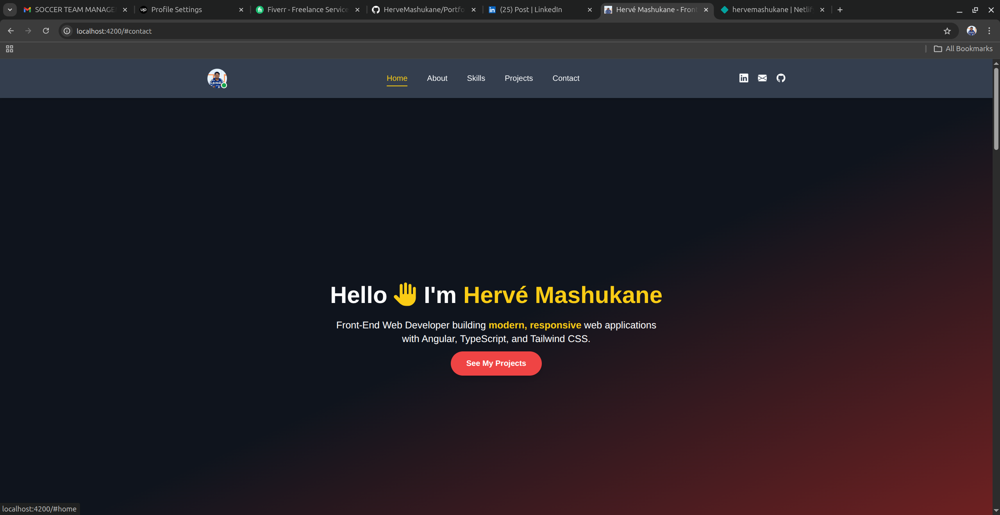
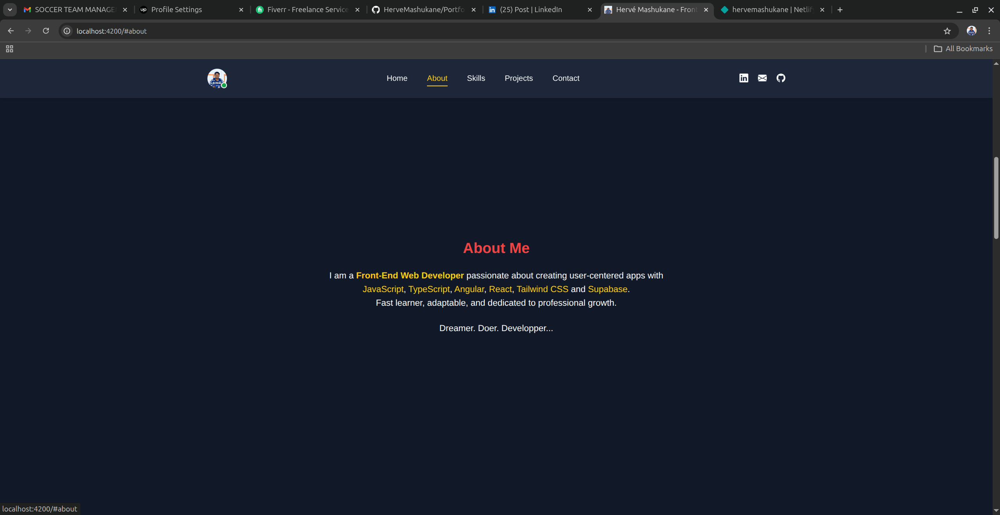
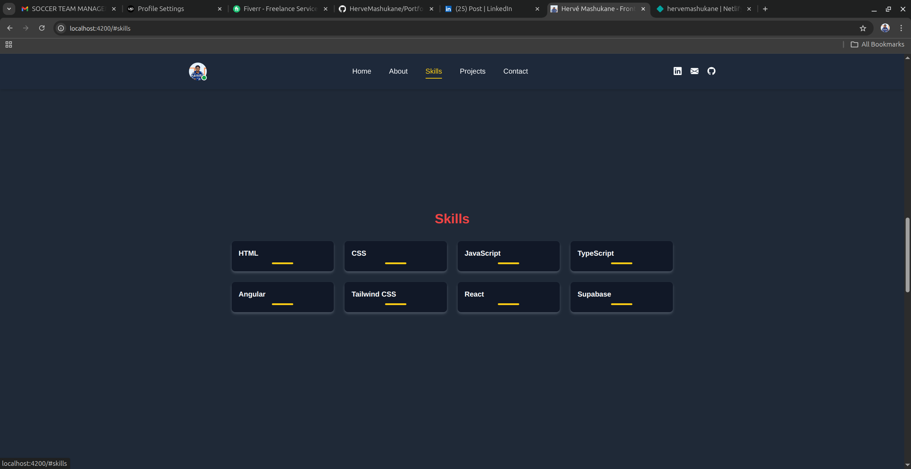
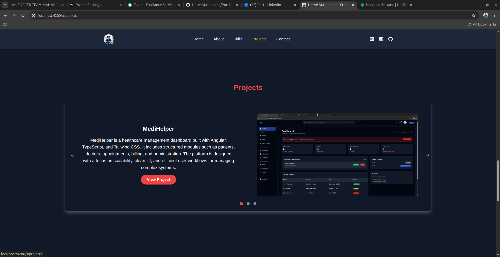
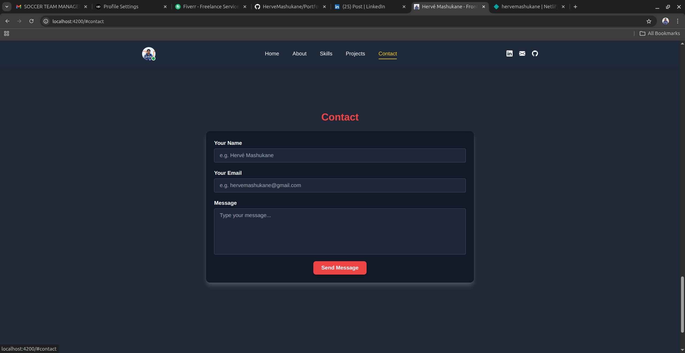

# Developer Portfolio

This is my personal portfolio website built using Angular, TypeScript, and Tailwind CSS.

## 🚀 Features

- Clean and modern UI design
- Responsive layout for all devices
- Project showcase section
- Skills and technologies overview
- Contact section

## 🛠 Tech Stack

- Angular
- TypeScript
- Tailwind CSS

## 🎯 Purpose

The portfolio highlights my frontend development skills, selected projects, and ability to build modern web applications.

## 📸 Screenshots

 

## 📌 Notes

This portfolio focuses on presenting frontend projects and technical capabilities in a professional and accessible way.